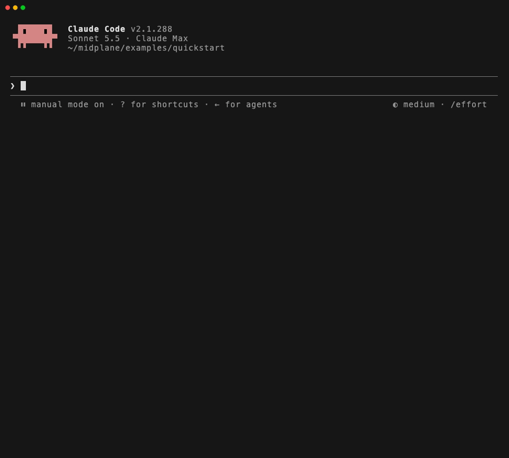
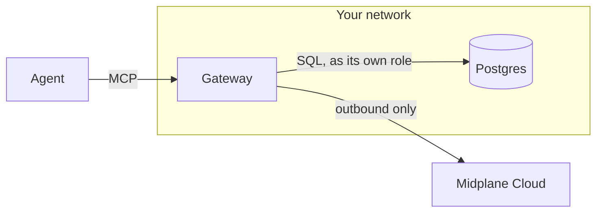

<p align="center">
  <a href="https://midplane.ai">
    <picture>
      <source media="(prefers-color-scheme: dark)" srcset="docs/logo/wordmark-on-dark.svg">
      
    </picture>
  </a>
</p>

<p align="center">
  <strong>A gateway between AI agents and your Postgres databases.</strong><br>
  Every statement is checked against your policy and recorded before it runs.
</p>

<p align="center">
  <a href="https://www.npmjs.com/package/midplane"></a>
  <a href="https://github.com/midplaneai/midplane/actions/workflows/ci.yml"></a>
  <a href="https://modelcontextprotocol.io"></a>
  <a href="LICENSE"></a>
</p>

<p align="center">
  <a href="#quickstart">Quickstart</a> ·
  <a href="https://midplane.ai/docs">Documentation</a> ·
  <a href="https://midplane.ai">Midplane Cloud</a>
</p>

Agents get useful once they can read your real tables, but a database role
that reads every column and writes every row is not a control you can show a
security reviewer. Midplane is that control. Agents connect to the gateway
over MCP; it parses each statement with Postgres' own parser, decides it
against your policy, records it, and only then runs it, with masks written
into the query itself.



## What it enforces

- **Table access**, denied by default, per table.
- **Masking** at the source: hashes, partial values, generalized dates, NULLs,
  applied before any filter, join or aggregate sees the raw value.
- **Guardrails**: one statement at a time, writes need a `WHERE`, no writes
  hidden in a `WITH`, reads in read-only transactions with timeouts.
- **Approvals**: writes held for a person, bound to the exact statement and
  checked against the row count the approver saw.
- **Containment**: once an agent reads a column labeled untrusted (support
  tickets, emails), its writes are held and secret tables are closed to it.
- **An audit log** on the gateway's own disk, hash-chained, exported and
  verified with one command.

The gateway runs in your network, next to your databases, and opens every
connection itself.



## Get started

- **A sample database, no account**: the [quickstart](#quickstart) below.
- **Your own database, with Midplane Cloud**, for policy in a dashboard,
  approvals and a query log; the cloud never holds a database credential or
  sees a row. Follow [get started](https://midplane.ai/docs/get-started).
  Midplane Cloud is invite-only for now: [get access](https://midplane.ai/#get-access).
- **Your own database, no account**: [local mode](https://midplane.ai/docs/gateway/local-mode).

The gateway is the `midplane` npm package, run with `npx`, or the image
`ghcr.io/midplaneai/midplane`. Both are built from this repository's tags
with provenance, and the image is signed: [verifying a release](https://midplane.ai/docs/releases).

## Quickstart

You need Node 24.16 or newer, Docker, and an MCP client such as Claude Code.

```sh
git clone https://github.com/midplaneai/midplane.git
cd midplane/examples/quickstart
docker compose up -d --wait
```

Then follow [its steps](examples/quickstart): a sample shop database and the
gateway in local mode, with nothing leaving your machine. Ask your agent:

| Ask | What happens |
| --- | --- |
| "List our customers with their emails and phone numbers." | Emails hashed, phones cut to the last four digits, signup dates to the month |
| "Delete all support tickets." | Denied: a write needs a `WHERE` |
| "Mark ticket 2 as closed." | Held for approval; local mode has nobody to ask, so it's refused |
| "Summarize ticket 1." | Its body carries a prompt injection; reading it taints the agent |
| "Now show me the API keys." | Denied: a tainted agent can't read secret tables |

In Midplane Cloud, **Try with sample data** runs the same sample linked, where
the held write waits for your approval instead.

## Documentation

[midplane.ai/docs](https://midplane.ai/docs):
[how it works](https://midplane.ai/docs/how-it-works),
[deploying the gateway](https://midplane.ai/docs/gateway/deploy),
[configuration](https://midplane.ai/docs/gateway/configuration),
[masking](https://midplane.ai/docs/policies/masking),
[approvals and taint](https://midplane.ai/docs/policies/approvals-and-taint),
[audit](https://midplane.ai/docs/audit) and
[troubleshooting](https://midplane.ai/docs/troubleshooting). Its source is in
[docs/](docs/).

## Contributing

Bugs and questions go to [issues](https://github.com/midplaneai/midplane/issues);
building and testing is in [CONTRIBUTING.md](CONTRIBUTING.md). Found a way
around a mask, a policy or the audit log? Report it privately:
[SECURITY.md](SECURITY.md).

## License

MIT, see [LICENSE](LICENSE).
