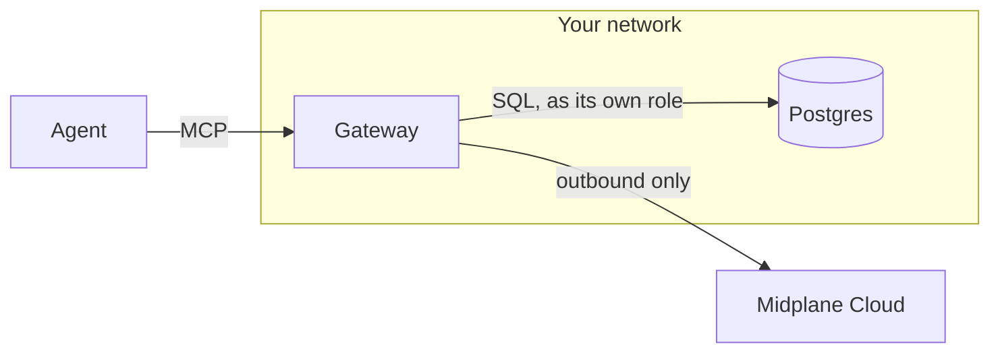

```mermaid
flowchart LR
  agent["Agent"] -->|"MCP"| gateway
  subgraph network ["Your network"]
    gateway["Gateway"] -->|"SQL, as its own role"| postgres[("Postgres")]
  end
  gateway -->|"outbound only"| cloud["Midplane Cloud"]
```
